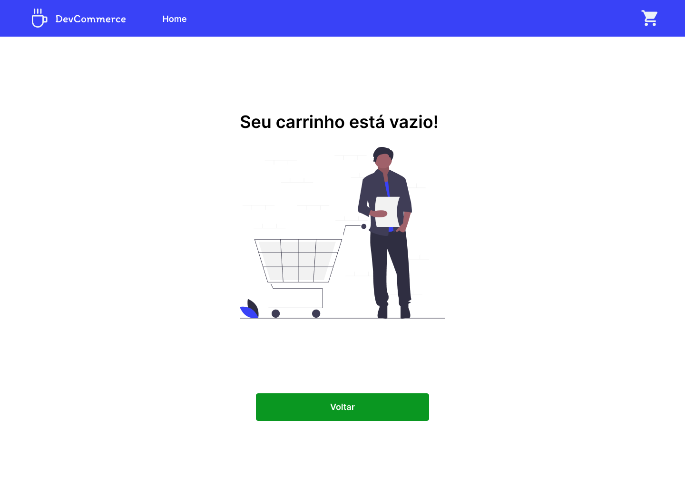

<div align="center">
    
</div>

<h3 align="center">Ecommerce para Devs</h3>

---
## :art: Layout
[Figma](https://www.figma.com/)

---
## :gear: Techs
- [ReactJS](https://reactjs.org/)
- [ReactRouter](https://reactrouter.com/)
- [Axios](https://axios-http.com/)
- [Yup](https://github.com/jquense/yup)

---
## :book: Features

### Login
<div align="center">
    
</div>

- [x] Verificação de email e senha

### Início
<div align="center">
    
</div>

- [x] Disponibilização dos itens orioundos de uma API
- [x] Adição do item selecionado ao carrinho

### Carrinho
<div align="center">
    
</div>

- [x] Disponibilização dos itens selecionados antes da compra
- [x] Adição/remoção de um item do carrinho
- [x] Alterar quantidade de um item
### Carrinho vazio
<div align="center">
    
</div>

- [x] Retorno visual quando elementos não forem inseridos no carrinho
### Informações
<div align="center">
    
</div>

- [x] Barra de acompanhamento da situação da compra, mostrando a área atual
- [x] Validação dos campos Nome e Sobrenome
- [x] Consumo de API para buscar informações do CEP digitado
### Cartão de crédito
<div align="center">
    
</div>
<div align="center">
    
</div>

- [x] Validação dos campos com expressões Regex
- [x] Animações ao entrar e sair do campo CVV
### Venda
<div align="center">
    
</div>

- [x] Retorno visual da conclusão da venda

---
## :desktop_computer: Como usar
- É necesário criar sua API para fornecer os dados da aplicação e preencher como variável de ambiente, com a chave
```
    REACT_APP_URL=
```
-- Após isso é necessário rodar no terminal o comando abaixo:
```
    yarn start
```
---
## :spiral_notepad: License
Arquivos sob a licença [MIT](https://github.com/lucasgomesgp) criado por Lucas Gomes.
